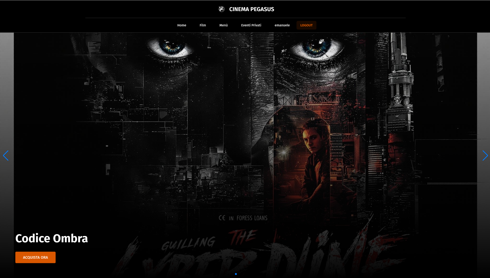
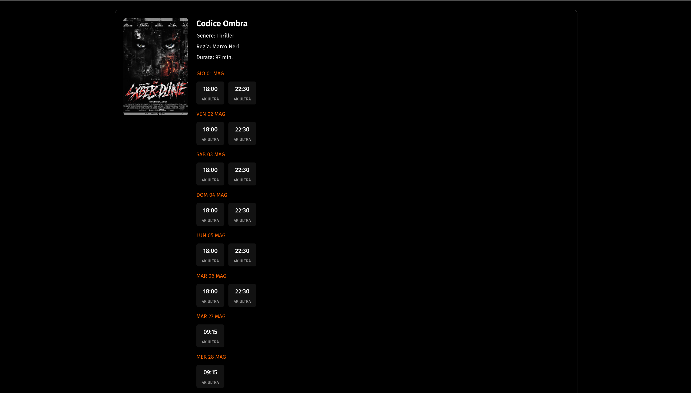
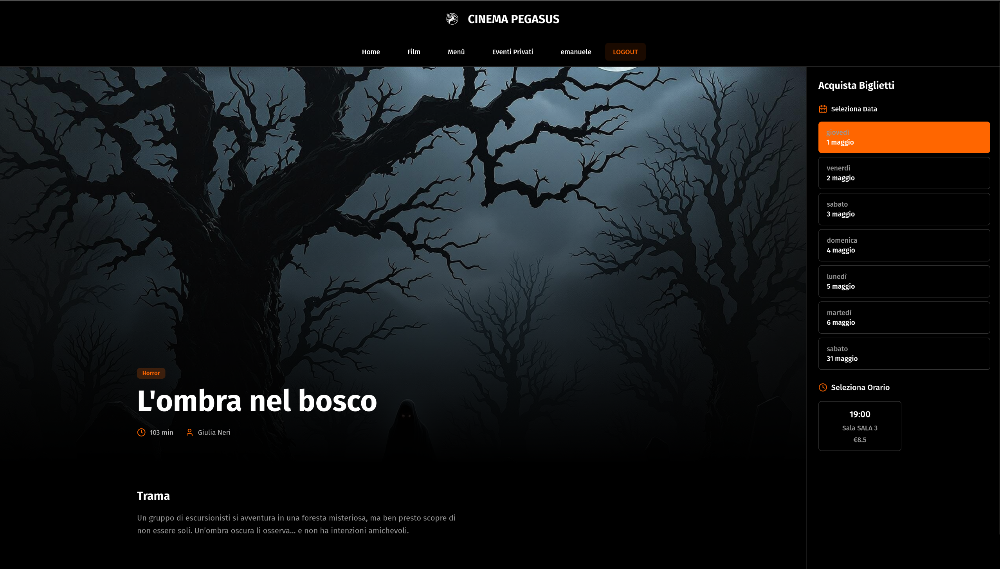
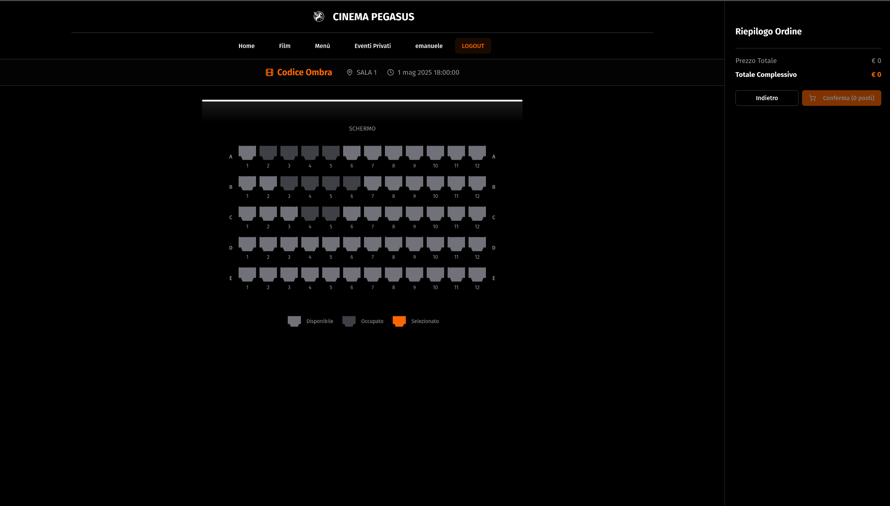
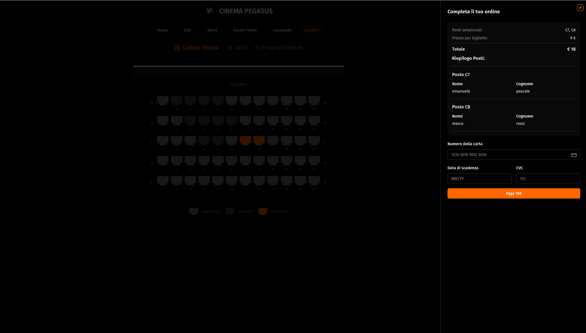
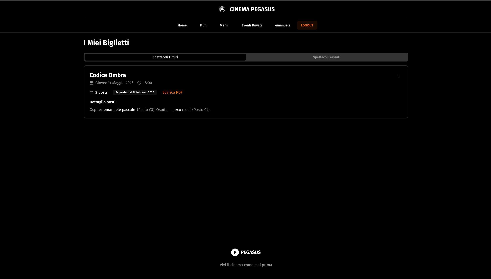

# 🎬 Cinema Pegasus - FRONTEND

Il progetto realizzato permette agli utenti di acquistare biglietti per i film in programmazione, visualizzare dettagli sulle proiezioni e gestire i propri ordini.
Questa repository contiene il codice relativo al layer di presentazione, ovvero il frontend dell'applicazione.

🔗 **Sito Online**:

Il deploy del sito è avvenuto con successo e lo si può trovare al seguente URL [Cinema Pegasus](https://projectwork-frontend.vercel.app)

## 📌 Tecnologie Utilizzate

- [React (Vite)](https://vite.dev/guide/)  
- [ShadCN/ui](https://ui.shadcn.com/)
- [TailwindCSS](https://tailwindcss.com/)  

## 📁 Struttura del Progetto

```bash
├── App.tsx
├── components         # Contiene i componenti UI scritti da me
│   ├── acquisto
│   ├── autenticazione
│   ├── film
│   │   ├── DettagliFilm
│   │   └── Homepage
│   ├── layout
│   │   ├── Footer.tsx
│   │   └── Header
│   ├── ordini
│   ├── posto
│   ├── ui            # Componenti UI di ShadCN
│   └── WorkInProgress.tsx
├── context           # Contiene il contesto globale di autenticazione
│   └── AuthContext.tsx
├── hooks             # Cartella che contiene i custom hooks scritti da me, tranne:
│   ├── use-mobile.tsx #Hook scritto da ShadCN
│   └── use-toast.ts  #Hook scritto da ShadCN
├── lib               # Utility fornite da ShadCN
│   └── utils.ts
├── pages             # Pagine principali del sito
├── services          # Interazioni con il backend
├── types             # Definizioni interfacce TypeScript
├── utils             # Funzioni di utilità generiche divise fra più componenti
└── vite-env.d.ts
```

## 🚀 Installazione

1. **Clona il repository**  
   ```bash
   git clone https://github.com/emanuelep57/projectwork-frontend
   cd projectwork-frontend
   ```

2. **Installa le dipendenze**  
   ```bash
   npm install
   ```

3. **Avvia il progetto**  
   ```bash
   npm run dev
   ```

## 🔑 Configurazione Ambiente

Crea un file `.env` nella root del progetto e aggiungi le seguenti variabili:

```env
VITE_API_URL=http://localhost:5000/api
```

## 📌 Funzionalità

✅ **Autenticazione** (Login, Registrazione, Logout)  
✅ **Visualizzazione dei film in programmazione**  
✅ **Visualizzazione dettagli dei film**  
✅ **Scelta dei posti e pagamento dei biglietti**  
✅ **Gestione e storico degli ordini**  
✅ **Download del biglietto in PDF**  

## 🛤️ Roadmap

🔲 Ottimizzazione delle prestazioni del sito  
🔲 Implementazione delle funzionalità di Menù (prenotazione cibo) e prenotazione della sala    
🔲 Implementazione di notifiche per la conferma delle prenotazioni  
🔲 Implementazione di un sistema di pagamento online  
🔲 Implementazione delle funzionalità di back office


## 📸 Esempi e Screenshot

### 📄 Esempio di Biglietto
[Visualizza un biglietto di esempio generato dal sito](public/biglietto.pdf)

### Screenshot delle principali funzionalità dell'applicazione:

### Homepage


### Sezione orari


### Dettagli Film


### Selezione Posti


### Checkout


### Ordini


